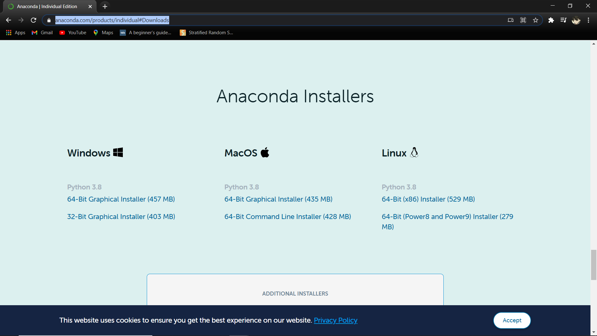
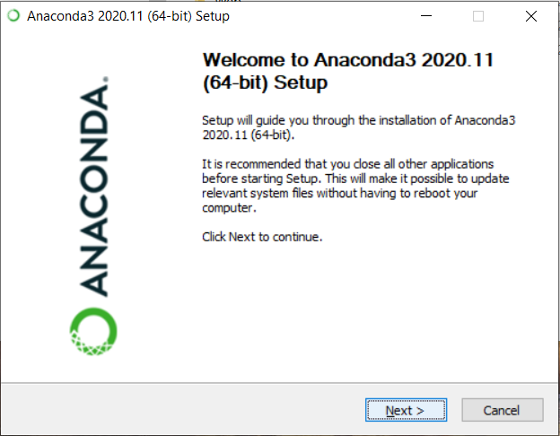
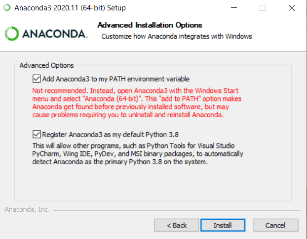
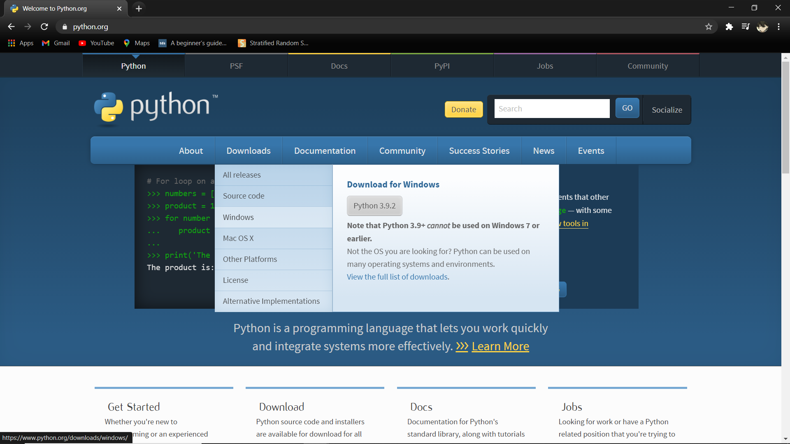
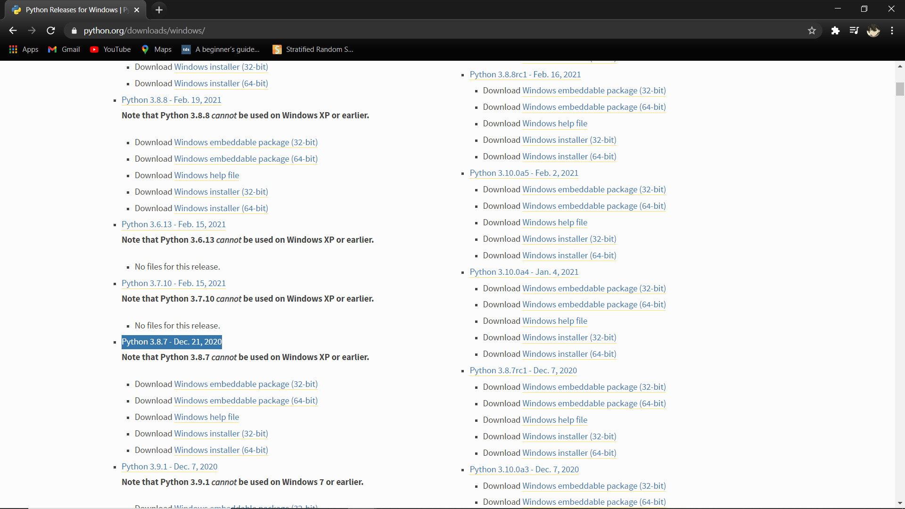
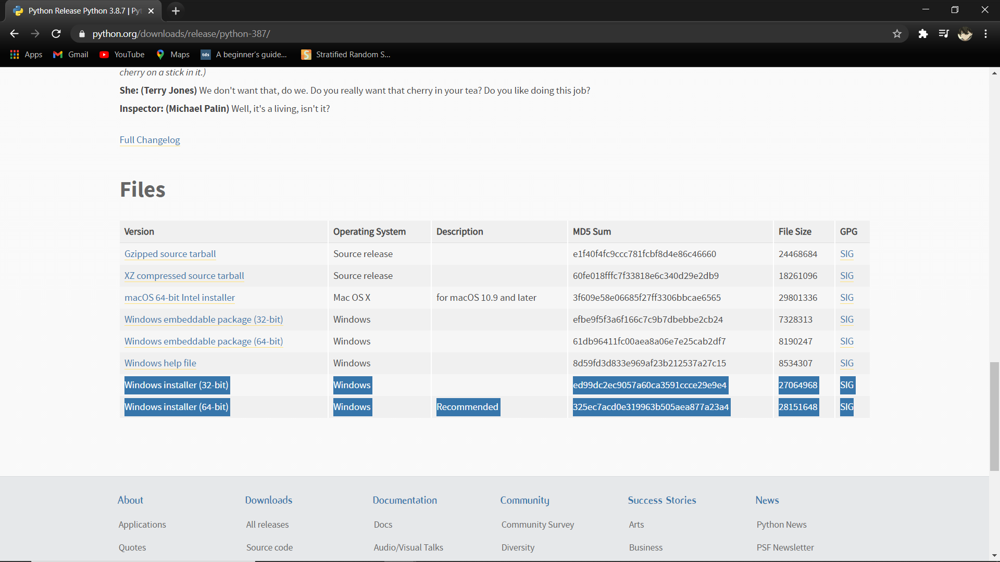
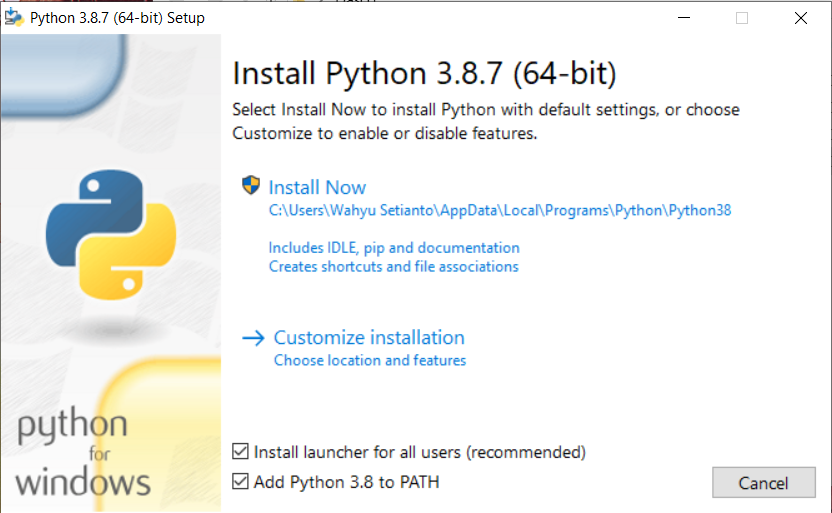

# Instalasi Python

Untuk instalasi python pertama kamu perlu lebih dahulu untuk memilih tipe yang kamu inginkan. Dianjurkan untuk memilih salah satu dari 2 tipe dibawah:

1. Anaconda Distribution
2. Python (Base Interpreter)

## Instalasi Anaconda Distribution

Berikut adalah cara instalasinya:

1. Download anaconda instaler di [anaconda.com](https://www.anaconda.com/products/individual#Downloads)<br>
   Pilih sesuai dengan ketentuan OS kalian.<br>
   1. Pilih `64-bit` jika OS berarsitektur `64-bit`
   2. Pilih `32-bit` jika OS berarsitektur `32-bit`<br>
     
2. Tunggu hingga proses download selesai dan buka installer.<br>
   <br>
   lalu pilih `next`
3. Pada bagian `Lincense & Agreement` pilih `I Agree`
4. Pada bagian `Install for :` pilih `Just me` lalu pilih `next`
5. Pada bagian `Destination Folder` pilih folder yang diinginkan untuk tempat penginstallan anaconda.
6. Lalu isi sesuai configurasi di bawah ini dan pilih `install`<br>
   
7. Tunggu hingga proses instalasi selesai

## Instalasi Python (Base Interpreter)

Berikut adalah cara instalasinya:

1. Download python instaler di [python.org](https://www.python.org/)<br>
   1. Pilih menu `Download` dan pilih `OS` yang kalian gunakan.<br> 
   2. Pilih versi python yang di inginkan. Dianjurkan untuk memilih antara versi `3.8.7` atau `3.8.8` yang merupakan versi stabilnya<br> 
   3. Download sesuai dengan ketentuan OS kalian.<br>
      1. Pilih `64-bit` jika OS berarsitektur `64-bit`
      2. Pilih `32-bit` jika OS berarsitektur `32-bit`<br>
        
2. Buka Installer yang sudah di Download<br>
3. Setting konfigurasi seperti gambar di bawah ini<br>
   <br>
   Lalu pilih `Install Now`
4. Tunggu hingga proses selesai dan pilih `close`

## Note:

Untuk yang memilih menggunakan `Python (Base Interpreter)` dianjurkan untuk menginstalasi library" berikut:

1. Numpy
2. Pandas
3. Matplotlib
4. Seaborn
5. Jupyter
6. Scikit Learn

Berikut adalah cara instalasinya:

1. Buka terminal atau `cmd`
2. Copy paste command dibawah lalu tekan `enter`
   ```cmd
   py -m pip install numpy pandas matplotlib seaborn jupyter scikit-learn
   ```
3. Tunggu hingga proses instalasi selesai dan library siap untuk digunakan

**© DASCO 2021**