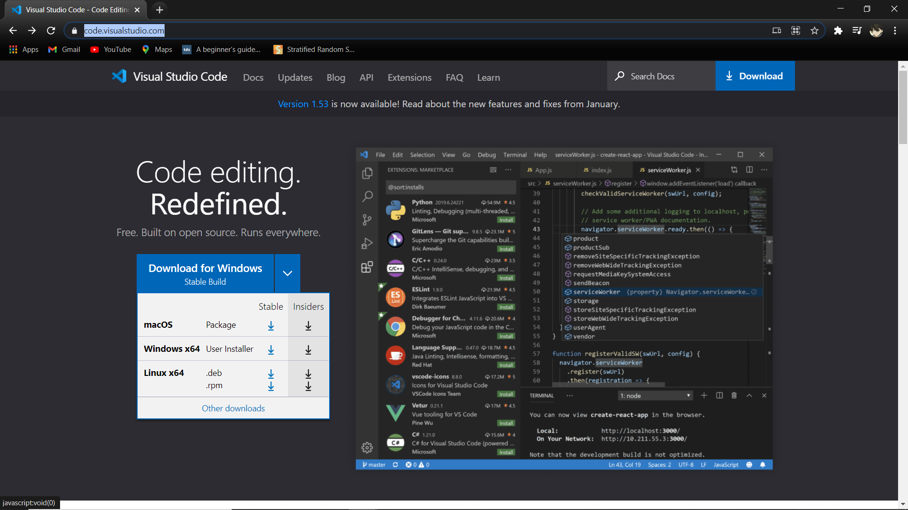
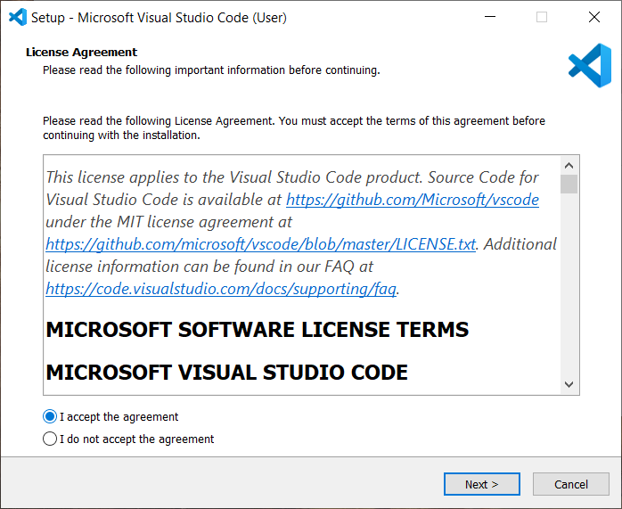
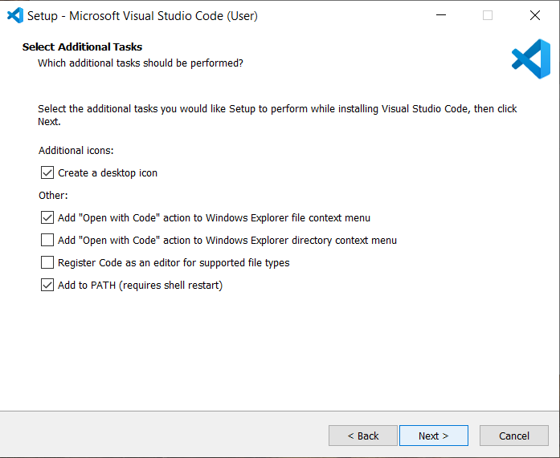
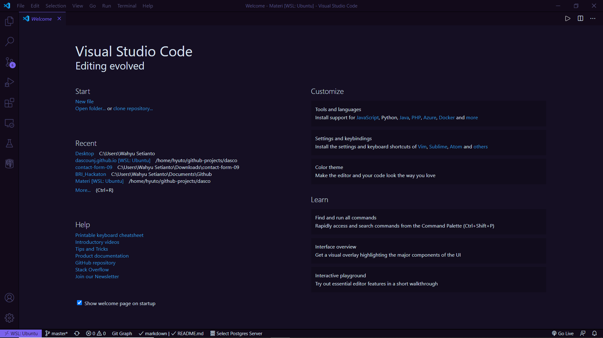
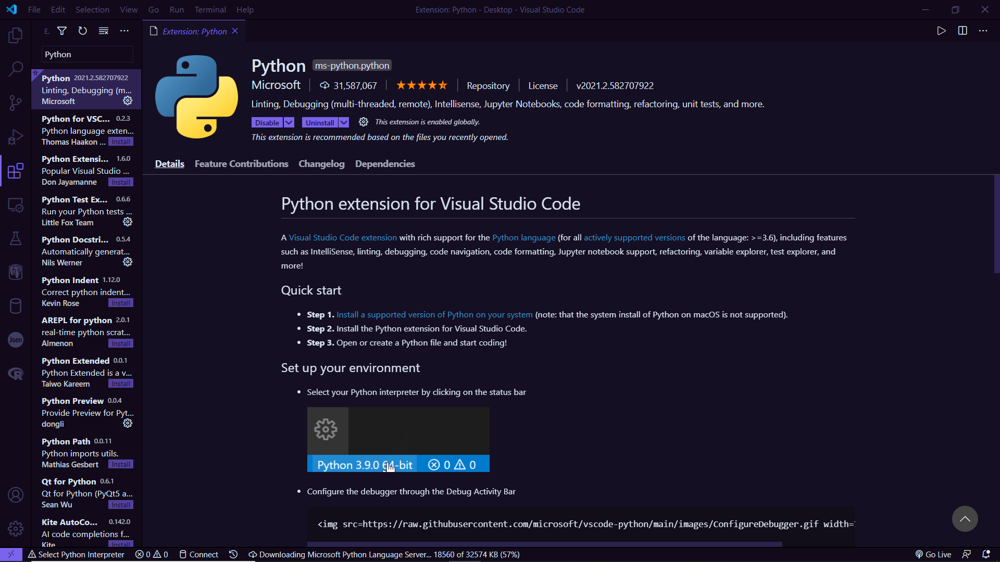

# Instalasi Text Editor

Text editor adalah tempat dimana user untuk melakukan pemrograman(scripting). Penginstalan text editor ini tidak diwajibkan untuk yang menggunakan `Anaconda Distribution` karena untuk anaconda sendiri sudah memiliki Text Editor (IDE lebih tepatnya) bawaan.

Instalasi text editor ini ditujuan untuk yang menggunakan `Python (Base Interpreter)` untuk memudahkan saat melakukan pemrograman nantinya.

Bebas untuk menggunakan text editor yang disukai namun direkomendasikan untuk menggunakan `Visual Studio Code (VSCode)`

## Instalasi VSCode

1. Download VSCode dari [code.visualstudio.com](https://code.visualstudio.com/) 
   Pada menu download pilih versi `stable` dan sesuaikan dengan arsitektur OS. 
   **Note** untuk yang beraksitektur `32-bit` pilih menu `Other downloads` terlebih dahulu. 
   
2. Tunggu hingga proses download selesai dan jalankan installer 
   Pilih `I accept the agreement` pada bagian `License Agreement` 
   
3. Lalu samakan setting dengan gambar di bawah lalu pilih `next` 
   
4. Selanjutnya pilih `Install` lalu tunggu hingga proses installasi selesai.

## Note

Dianjurkan untuk memasang Extensi `Python` pada VSCode. Berikut adalah cara pemasangannya:

1. Buka VSCode 
   
2. Pada bagian sebelah kanan pilih menu `Extensions` lalu search `Python`  
   
3. Install extensi `Python`

**© DASCO 2021**